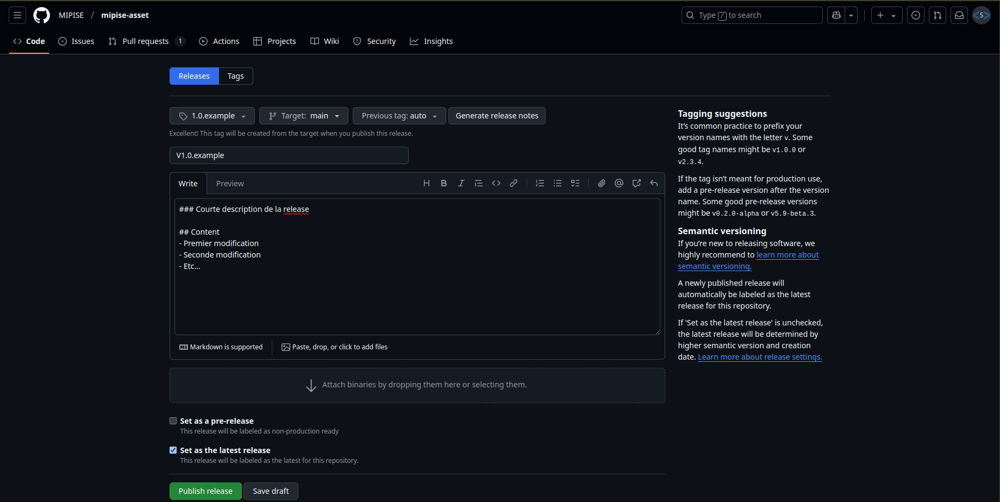

# Mipise-Asset

---

## Introduction
La gem Mipise-Asset a été créée dans le cadre d'une centralisation des assets partagés entre les différentes applications de la société **Mipise**.

---

## Installation
Pour installer la gem, il suffit de venir ajouter un point dans le fichier **Gemfile** vers ce répôt.
### Example :
```ruby
gem "mipise-asset", github: "MIPISE/mipise-asset", tag: "0.1.0" # Mipise Assets
```

*Le cas présenté est basé sur l'utilisation des tags de Git. Les différentes versions sont disponibles dans l'onglet [Releases](https://github.com/MIPISE/mipise-asset/releases).*

Ensuite, il faudra exécuter :
```sh
bundle install
```

---

## Implémentation
Il existe de manières d'implémenter la gem **Mipise-Asset**.
### Projet Ruby On Rails :

> La gem détecte automatiquement l'utilisation de Ruby On Rails pour y intégrer les assets. Ainsi, aucune action n'est nécessaire au niveau des initializers pour l'importation des fichiers.

Un chemin relatif est automatique créé pour les fichiers principaux de la gem.

Dans le cas du **SCSS**, il faut intégrer cette ligne :
```scss
@import "mipise-asset/app";
```

Dans le cas du **JavaScript**, il faut intégrer cette ligne :
```js
//= require mipise-asset/app
```

### Projet sans Ruby On Rails

La gem inclut des méthodes statiques dans le module `MipiseAsset` permettant de construire un chemin absolu dynamiquement vers les dossiers d'assets.

Il vous suffit de venir importer vos fichiers dans votre projet à l'aide de ses chemins.

### Example :
```ruby
File.join MipiseAsset::stylesheets_path, "mipise-asset", "app.scss"
```

---

## Modification
Le processus de modification de la gem est le suivant :
1. Création d'une branch comportant les modifications
2. Ouverture d'un [Pull requests](https://github.com/MIPISE/mipise-asset/pulls)
3. Lors du merge de ce PR, il faudra créer une [Nouvelle Release](https://github.com/MIPISE/mipise-asset/releases/new) en suivant ce model :

4. Validation de la création avec le bouton ***Publish Release***
5. Modification du tag dans les Gemfile des différentes applications
